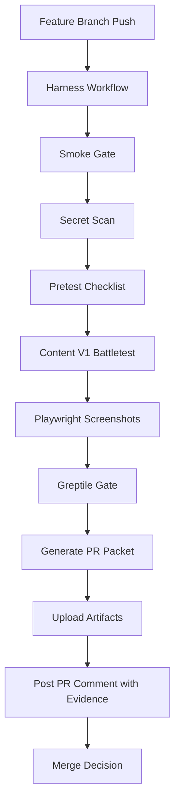
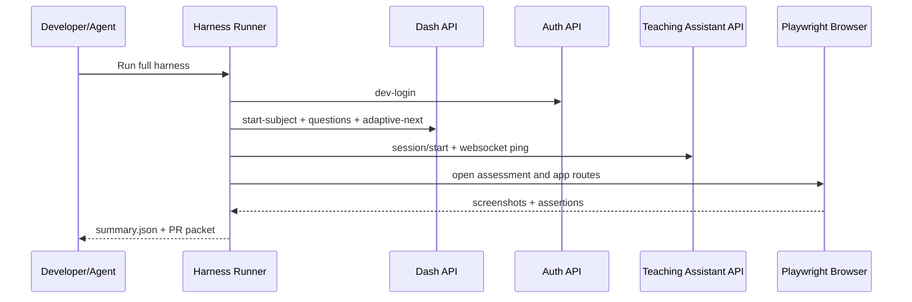

# Content Pipeline Harness

This harness is the mandatory gate before any content-pipeline feature PR can merge.

## Goal

Ship a fast and reliable generative content pipeline with correctness guards for:

- duplicate question prevention
- valid subject-scoped question generation
- assessment-to-learning-path continuity
- sufficient question count and answerable widgets
- frontend widget and floating-panel stability
- grading and skill-path integrity
- websocket stability for session signals

## Gate Sequence

1. `smoke_test.py`
2. `secret_scan.sh`
3. `pretest_checklist.py` (existing broad QA suite)
4. `content_v1_battletest.py` (existing multi-topic content stress test)
5. Playwright browser test + screenshots
6. Greptile review gate
7. PR packet generation (acceptance criteria + evidence)

## Gate Contract

| Gate | What it validates | Blocks merge |
| --- | --- | --- |
| Smoke | Health checks, dev-login auth, subject start, question contract, duplicate/content checks, adaptive next-question latency, websocket ping/pong | Yes |
| Secret scan | Prevents accidental API key/secret leakage in changed files | Yes |
| Pretest checklist | Subject sweep, render contract, duplicate IDs/content, adaptive non-early-complete behavior, cold-subject safety | Yes |
| Content v1 battletest | Topic progression, queue depth, source consistency, format variety | Yes |
| Playwright evidence | UI rendering for assessment widget container and floating control panel, hydration/render compatibility check, Z-index collision check, screenshot capture for QA | Yes |
| Greptile review | Automated semantic/code review verdict | Yes (unless explicitly configured optional) |
| PR packet | Acceptance criteria, gate outputs, screenshot references, merge policy checklist | Yes |

## Acceptance Criteria (PR must include)

- [ ] No duplicate questions by ID or normalized content fingerprint
- [ ] Questions are subject-correct (no science-to-math contamination)
- [ ] Assessment serves a full adaptive sequence (not stuck at 1-2 questions)
- [ ] Adaptive assessment is stable through at least 8 consecutive next-question transitions (no fatal break around Q4/Q5)
- [ ] Every served question has an answer area and renderable widget config
- [ ] Next question latency is within threshold budget
- [ ] Grading and skill-path metadata are present and valid
- [ ] Grading correctness parity: rendered radio option selections map to the correct answer key (no selectedChoiceIds mismatch)
- [ ] No leaked wrapped-quote choice text and no duplicate `Choose 1 answer` labels in rendered/served question content
- [ ] DASH system is healthy and functional end-to-end (health, auth, subject start, question fetch)
- [ ] Adaptive assessment start works across all available subjects (no terminal 400 or invalid payload)
- [ ] Learning mode path stays subject-correct and content-valid (recommend-next has no cross-subject contamination)
- [ ] Question loading times are optimized for max speed (initial load + learning recommend-next + adaptive start + next-question within budget)
- [ ] Loading latency checks cover both modes and sustained flow (learning recommend-next + repeated adaptive next transitions)
- [ ] Websocket session ping/pong is healthy under auth
- [ ] Frontend UI/UX stability checks pass (core widget and floating panel visible/usable)
- [ ] Primary assessment actions (`Submit Answer` / `Next Question`) stay visible and reachable without manual scrolling
- [ ] Assessment question view has zero browser-level vertical scroll at desktop baseline; question content, hints, and actions are simultaneously usable
- [ ] Assessment question view has zero internal question-container scroll at desktop baseline; question/options/hints/actions fit without manual scrolling
- [ ] Assessment question container overflow contract holds: `#question-content-container` does not compute to `overflow-y:auto` in active assessment view
- [ ] Visual-heavy prompts (images/diagrams/charts) are compacted to viewport and do not push `Submit`/`Next` below fold at desktop baseline
- [ ] Assessment question view remains zero-window-scroll after opening at least one hint (no late overflow regression)
- [ ] Learning mode (`/app/learn/:subject`) has zero browser-level vertical scroll at desktop baseline while question and action controls remain visible
- [ ] Widget-family render integrity holds in browser checks: radio, dropdown, and text/numeric widgets render inside question container with no detached overlays/stray option text
- [ ] Dropdown anchor integrity holds: opened listbox stays anchored near combobox trigger and fully visible in viewport on assessment and learning routes
- [ ] Theme integrity holds in both modes: light and dark toggles must render question surfaces/text in the correct theme with no mixed-mode artifacts
- [ ] Question content contrast passes in both themes (light/dark) on assessment and learning routes
- [ ] Hint control legibility passes in both themes: `Show Hint`/`Hint` button text remains high-contrast and readable in assessment and learning routes
- [ ] Selected radio option highlight is visually complete (full 4-sided outline; no clipped/incomplete blue border segments)
- [ ] Assessment completion transitions into subject-scoped learning state (not generic homepage/app-shell fallback)
- [ ] Adaptive assessment reaches completion in 10 answered questions without manual retry loops on repeated `/assessment/next` 503 responses
- [ ] Synthetic fallback question IDs always resolve to source question payloads so adaptive continuity cannot dead-end
- [ ] Responsive layout is production-safe (no horizontal overflow/clipping on desktop and mobile breakpoints)
- [ ] Playwright screenshots captured for assessment and floating panel
- [ ] Floating panel is not obscured by widget container (Z-index collision check)
- [ ] Floating panel is fully visible on both `/app` and `/app/:id` routes (no clipped/sliver/off-screen render)
- [ ] AI-generated content payload matches renderable browser output (hydration/render compatibility)
- [ ] Pretest + content battletest pass across topics
- [ ] No leaked secrets/API keys in changed files

## Merge Policy

Merge is allowed only when all are true:

1. Harness summary status is `ok: true`.
2. No required gate is skipped.
3. PR contains generated acceptance checklist and screenshot evidence.
4. Greptile gate is pass (or an explicit reviewer override is documented in PR).
5. Smoke + Playwright were executed on the same commit SHA being merged.

## CI/PR Architecture

## Runtime Diagram

## Commands

- Run all gates: `python3 scripts/harness/run_pipeline_harness.py`
- Run all except Greptile: `HARNESS_REQUIRE_GREPTILE=0 python3 scripts/harness/run_pipeline_harness.py`
- Force auto-start stack for browser tests: `HARNESS_AUTO_START=1 python3 scripts/harness/run_pipeline_harness.py`

## Greptile Setup (Secrets-Only)

- Local:
  - `export GREPTILE_API_KEY='<your_key>'`
  - `export GREPTILE_REVIEW_COMMAND='<your greptile review command>'`
  - `export HARNESS_REQUIRE_GREPTILE=1`
- CI (GitHub):
  - add repository secret: `GREPTILE_API_KEY`
  - add repository variable: `GREPTILE_REVIEW_COMMAND`
  - set repository variable: `HARNESS_REQUIRE_GREPTILE=1`

Do not commit API keys into repo files. The harness reads them from environment only.
